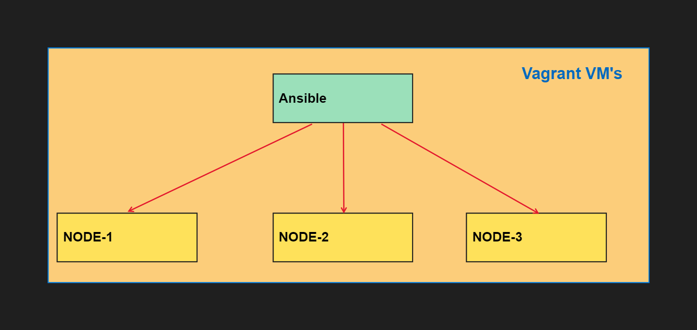

## This is for the exam practice lab for RHCE(EX-294)

**Requirement need to have knowledge on RHEL Linux.**

**Lets setup the lab using Vagrant. Required links are below**

- **VMware Link:https://www.virtualbox.org/wiki/Downloads** 
- **Vagrant Link:https://developer.hashicorp.com/vagrant/downloads** 

**After Downloading kindly install the VMware in your machine.**

## Lab Topology:

**Now create a new folder in anywhere in you HDD but make sure whenever you need to power on the labs you need to run Vagrant command from that particular path only**

```SHELL
sudo mkdir Ansible
```

**Now create a SSH key to login automatically instead of giving password**

```SHELL
sudo ssh-keygen
```

**So now we need to create a Vagrant file in that we will be add few parameter's like IP, RAM,HDD ..etc**

**Add the below content in Vagrant file & save this file inside of Ansible folder**
```Vagrant
Vagrant.configure("2") do |config|
  servers=[
    {
      :hostname => "ansible.example.com",
      :box => "eurolinux-vagrant/centos-stream-9",
      :ip => "192.168.56.100",
      :ssh_port => '2210'
    },
    {
      :hostname => "node1.example.com",
      :box => "eurolinux-vagrant/centos-stream-9",
      :ip => "192.168.56.101",
      :ssh_port => '2211'
    },
	{
      :hostname => "node2.example.com",
      :box => "eurolinux-vagrant/centos-stream-9",
      :ip => "192.168.56.102",
      :ssh_port => '2212'
    },
	{
      :hostname => "node3.example.com",
      :box => "eurolinux-vagrant/centos-stream-9",
      :ip => "192.168.56.103",
      :ssh_port => '2213'
    }

  ]

  servers.each do |machine|

    config.vm.define machine[:hostname] do |node|
      node.vm.box = machine[:box]
      node.vm.hostname = machine[:hostname]
    
      node.vm.network :private_network, ip: machine[:ip]
      node.vm.network "forwarded_port", guest: 22, host: machine[:ssh_port], id: "ssh"

      node.vm.provider :virtualbox do |v|
        v.customize ["modifyvm", :id, "--memory", 512]
        v.customize ["modifyvm", :id, "--name", machine[:hostname]]
      end
    end
  end

  id_rsa_key_pub = File.read(File.join(Dir.home, ".ssh", "id_rsa.pub"))

  config.vm.provision :shell,
        :inline => "echo 'appending SSH public key to ~vagrant/.ssh/authorized_keys' && echo '#{id_rsa_key_pub }' >> /home/vagrant/.ssh/authorized_keys && chmod 600 /home/vagrant/.ssh/authorized_keys"

  config.ssh.insert_key = false
end
```

**Now power on the VM using Vagrant use below Command**

**Note: Make sure to run the below command from Ansible folder only or else you will be getting error**

```SHELL
vagrant up
```

**This will power on all the 4 VM's if you want turn on 1 VM use (vagrant up node1.example.com)**

**NOW OUR LAB IS READY FOR ANSIBLE**

# Lets Configure our Lab

**Take SSH of ansible.example.com**

```SHELL
vagrant ssh ansible.example.com   # run in the same path (Ansible Folder)
```

**Inside the ansible VM**

**Become root user first**

```SHELL
[vagrant@ansible ~] sudo su -
```

**Lets check for Sudo-configurations now**

```SHELL
[vagrant@ansible ~] visudo -c
#you will seeing error in /etc/sudoers.d/vagrant: bad permissions, should be mode 0440
[vagrant@ansible ~] chmod 440  /etc/sudoers.d/vagrant
visudo -c
```

**Lets cat the vagrant  file**

```SHELL
[vagrant@ansible ~] cat /etc/sudoers.d/vagrant
#output:%vagrant ALL=(ALL) NOPASSWD: ALL
#it says any user part of vagrant group can login with no password which is good.
#now we will create a devops user & add vagrant group as secondary group.
```

**Creating & adding Vagrant group to devops user:**

```SHELL
[vagrant@ansible ~] useradd -G vagrant devops  #-G is used as adding secondary group(vagrant) to devops user
id devops
```

**Creating password to devops user:**

```SHELL
[vagrant@ansible ~] echo "redhat" | passwd devops -stdin 
```

**NOW LOGIN TO NODE1,2,3 AND DO THE SAME STEPS WHICH WE HAVE DONE IN ANSIBLE SERVER**

**Now inside of ansible named server login as devops user**

```SHELL
[vagrant@ansible ~] su -devops
```


**Lets create SSH-keys for devops user. So that we can connect with other nodes like node1 node2 node3 with password-less-authentication**

```SHELL
[devops@ansible ~]ssh-keygen # just given enter enter enter key will be generated
```

**At this point we already have created devops user in all 4 servers. Now from ansible server we have created SSH key. we need to transfer the key to node1,2,3 for password-less authentication**

```SHELL
[devops@ansible ~] ssh-copy-id node1
[devops@ansible ~] ssh-copy-id node2
[devops@ansible ~] ssh-copy-id node3
```

But here from ansible node servers are not reachable we can check with using ping command.ping node1. Here before running ssh-copy-id, we need to add DNS entries after that we can run the above commands. so lets do it.

```SHELL
sudo su -
vi /etc/hosts
inside of host file add the dns entries
192.168.56.101	node1
192.168.56.102	node2
192.168.56.103	node3
:wq!
```

# Install ansible in ansible server(control-server)

**Here as it is a linux server we can use dnf or yum but the issue is it will not install all the modules. so we have alternative we can install ansible using python**

**Using python it will install all the modules of ansible**

**First we need to install pip**

```SHELL
[devops@ansible ~] curl https://bootstrap.pypa.io/get-pip.py -o get-pip.py
[devops@ansible ~] python3 get-pip.py --user
[devops@ansible ~] python3 -m pip -V
 
```

**Installing Ansible**

```SHELL
[devops@ansible ~] python3 -m pip install --user ansible
[devops@ansible ~] ansible --version
```

# Configuring Ansible:

**Create one more directory named projects and go inside of that directory**

```SHELL
[devops@ansible ~] mkdir projects
[devops@ansible ~] cd projects
```

# Creating a inventory file:

```SHELL
vi inventory    #Creating a inventory file & adding our vm's
	-node1
	-node2
	-node3
wq!
```

# Creating a Anisble.cfg file:

```SHELL
vi ansible.cfg
	 [defaults]
	inventory = ./inventory
	remote_user = user
	ask_pass = false
	
	[privilege_esclation]
	become = true
	become_method = sudo
	become_user = root
	become_ask_pass = false
:wq!
```

**Now we can test ansible automation**

```SHELL
ansible all -m ping
```

# Points to remembers

- ** We should run the ansible commands or playbooks inside project directory. Because inventory and .cfg file present in project directory**
- **If we are running outside of the directory we will be getting the error.**

