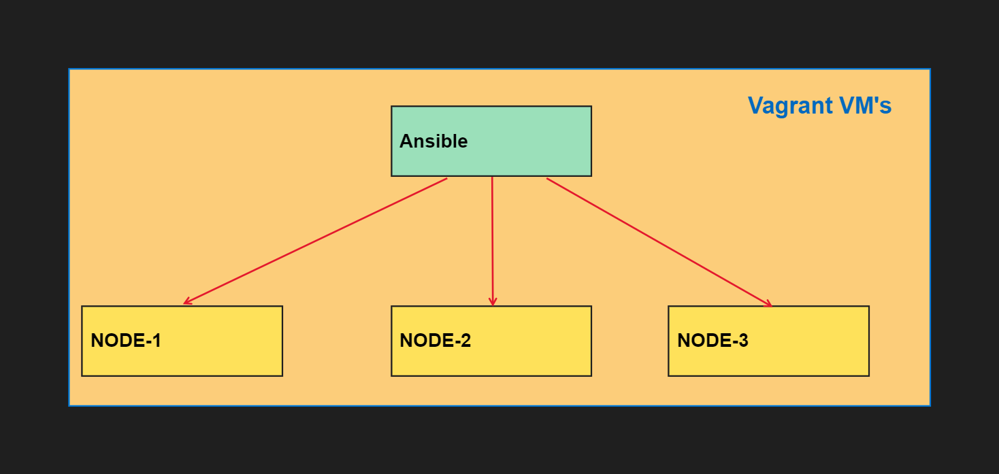

# Ansible (RHCE) Class Day:1

**Lab_Creation:**


**- VirtualBox: https://www.virtualbox.org/wiki/Downloads**


**- Vagrant:  https://developer.hashicorp.com/vagrant/downloads**



**Download these two files and install in you system.**

**Now create a new folder in anywhere in you HDD but make sure you need to run the Vagrant from that folder only if you are trying from another path Vagrant will not work**

```Laptop
D: \ ANSIBLE
```
**Now create a SSH key to login automatically instead of giving password**

```bash
ssh-keygen
```
**So now we need to create a Vagrantfile in that we will be add vmnames, os, ip,etc**


**Add the below content in Vagrantfile.**

```Vagrantfile

Vagrant.configure("2") do |config|
  servers=[
    {
      :hostname => "ansible.example.com",
      :box => "eurolinux-vagrant/centos-stream-9",
      :ip => "192.168.56.100",
      :ssh_port => '2210'
    },
    {
      :hostname => "node1.example.com",
      :box => "eurolinux-vagrant/centos-stream-9",
      :ip => "192.168.56.101",
      :ssh_port => '2211'
    },
	{
      :hostname => "node2.example.com",
      :box => "eurolinux-vagrant/centos-stream-9",
      :ip => "192.168.56.102",
      :ssh_port => '2212'
    },
	{
      :hostname => "node3.example.com",
      :box => "eurolinux-vagrant/centos-stream-9",
      :ip => "192.168.56.103",
      :ssh_port => '2213'
    }

  ]

  servers.each do |machine|

    config.vm.define machine[:hostname] do |node|
      node.vm.box = machine[:box]
      node.vm.hostname = machine[:hostname]
    
      node.vm.network :private_network, ip: machine[:ip]
      node.vm.network "forwarded_port", guest: 22, host: machine[:ssh_port], id: "ssh"

      node.vm.provider :virtualbox do |v|
        v.customize ["modifyvm", :id, "--memory", 512]
        v.customize ["modifyvm", :id, "--name", machine[:hostname]]
      end
    end
  end

  id_rsa_key_pub = File.read(File.join(Dir.home, ".ssh", "id_rsa.pub"))

  config.vm.provision :shell,
        :inline => "echo 'appending SSH public key to ~vagrant/.ssh/authorized_keys' && echo '#{id_rsa_key_pub }' >> /home/vagrant/.ssh/authorized_keys && chmod 600 /home/vagrant/.ssh/authorized_keys"

  config.ssh.insert_key = false
end

``` 

**Now power on the VM using Vagrant use below Command**

```CLI
vagrant up
```
**This will power on all the 4 VM's  if you want turn on one 1 PVM use (vagrant up node1.example.com)**

**Note: run the command in the path which we pasted Vagrantfile.**


# NOW OUR LAB IS READY FOR ANSIBLE 

**Take SSH of ansible.example.com**

```CLI
vagrant ssh ansible.example.com   # run in the same path
```

 **Inside the ansible VM**
 
 ```BASH
 dnf search ansible  #if repo is not present you need to configure the repo
sudo su -
dnf install ansible-core
ansible --version
useradd devops
	visudo -c
	you will seeing error in /etc/sudoers.d/vagrant: bad permissions, should be mode 0440
chmod 440  /etc/sudoers.d/vagrant
visudo -c   #now you can see no issues in visudo files
cat /etc/sudoers/vagrant    # it says any user part of vagrant group login will no password which is good now we will add devops user whcih we hacreated to vagrant group.
useradd -G vagrant devops
passwd devops
Last step is to create ssh-keys for devops user.
su -devops
ssh-keygen  enter enter enter.
SSH-KEYs has been created  now we need to transferred this key to all the remaining node node1 node2 node3.
ping  node1,node2,node3    #but we are not able to ping to the node1,2,3
sudo su -
vi /etc/hosts
inside of host file add the dns entries
192.168.56.101	node1
192.168.56.102	node2
192.168.56.103	node3
 :wq!

```

 ***ping node1 node2 node3  # this time this will ping to the servers***

**Login to node1,2,3 and do the same process:**
```BASH
chmod 440  /etc/sudoers.d/vagrant
useradd -G vagrant devops
passwd devops
```
**Now login to ansible node and try to take SSH devops@node1  # we can able to login to node1 ,2 ,3**
**Now while to doing SSH it is asking password to avoid it we have already created a SSH-key now we need to transfer that SSH key to all the nodes node1,2,3**

## In Ansible Node
```BASH
su - devops
ssh-copy-id devops@node1
ssh-copy-id devops@node2
ssh-copy-id devops@node3
```

**Now from ansible user we can able to login to all the nodes without any password**
<center><mark>*****Lab Setup completed*****</mark></center>

**Now we will perform a simple ansible code for testing**
# Creating a inventory file

```BASH
 mkdir projects
 cd projects
 vi inventory    #Creating a inventory file & adding our vm's
	-node1
	-node2
	-node3
wq!
```

# Creating a Anisble.cfg file:

```BASH
vi ansible.cfg
	 [defaults]
	inventory = ./inventory
	remote_user = user
	ask_pass = false
	
	[privilege_esclation]
	become = true
	become_method = sudo
	become_user = root
	become_ask_pass = false
:wq!
```

**Now we can test ansible automation**

```BASH
ansible all -m ping

```

**Now we can able to see the results**

<center><mark>'*****IT NEEDS PYTHON3 it python is not present then use yum install python3*****'</mark></center>
